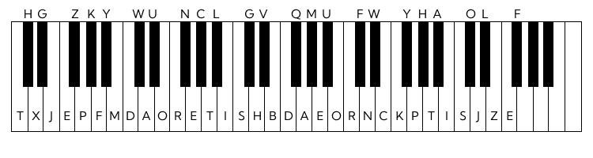

1. Plug in your MIDI-piano
2. Plug in the foot pedal (it's the space bar)
3. start `Midi-reader.py` and select the MIDI input of your choice
4. have fun (you can start `word-game.py` if you want or just start playing / typing)

Mapping:

Furthermore we extended the mapping with:

1. `BACKSPACE` key = MIDI-note 71
2. `ENTER` key = MIDI-note 72

If you want to see the algorithm mentioned in the paper, check out the `algorithm`-folder!
