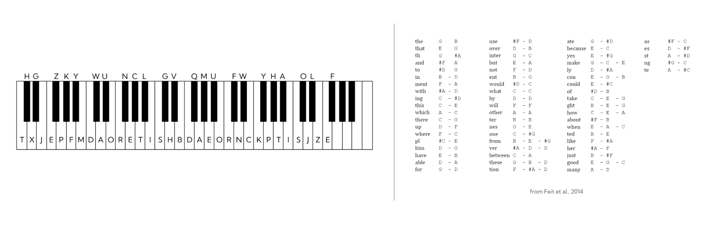

# Documentation

**Team Top-Idee: Christoph Wührl & Sabrina Hößl**

*or like in FlexNow lists: Christoph W?hrl & Sabrina H??l*

## 1. Paper-Stuff

First step was to find a paper that suits the requirements. We had read a few papers we found interesting:

* Preemptive Action: Accelerating Human Reaction using Electrical Muscle Stimulation Without Compromising Agency
  * Kasahara et al., 2019 | [https://doi.org/10.1145/3290605.3300873](https://doi.org/10.1145/3290605.3300873)
  * Reasons against it:
    * time - research about how to trigger the right muscle contraction
    * hardware - EMS TENS not available; we bought a cheap one just for fun but it lacks in control functionality
* Purring Wheel: Thermal and Vibrotactile Notifications on the Steering Wheel
  * San Vito et al., 2020 | [https://doi.org/10.1145/3382507.3418825](https://doi.org/10.1145/3382507.3418825)
  * Reasons against it:
    * hardware - sensors not available
    * application - just not cool enought
* Tactile Wayfinder: A Non-Visual Support System for Wayfinding
  * Heuten et al., 2008 | [https://doi.org/10.1145/1463160.1463179](https://doi.org/10.1145/1463160.1463179)
  * Reasons against it:
    * hardware - vibration modules to buy
    * application - just another navigation application
* TeslaTouch: electrovibration for touch surfaces
  * Bau et al., 2010 | [https://doi.org/10.1145/1866029.1866074](https://doi.org/10.1145/1866029.1866074)
  * Reasons against it:
    * hardware - no idea what we would've needed for it
* Touché: enhancing touch interaction on humans, screens, liquids, and everyday objects
  * Sato et al., 2012 | [https://doi.org/10.1145/2207676.2207743](https://doi.org/10.1145/2207676.2207743)
  * our favorite for a long time
  * Reasons against it:
    * hardware - no idea what sensors we needed + where to get them in the short time
    * plus we know our luck with sensors. The more we implement, the more will go wrong
* An Intuitive Tangible Game Controller
  * Foottit et al., 2014 | [https://doi.org/10.1145/2677758.2677774](https://doi.org/10.1145/2677758.2677774)
  * Reasons against it:
    * hardware - lot of sensors (same as before: sensors and team top-idee would go wrong just because it's us)

**Our decision**:

PianoText: redesigning the piano keyboard for text entry | Feit et al., 2014 | [https://doi.org/10.1145/2598510.2598547](https://doi.org/10.1145/2598510.2598547)

*insert short summary here*

## 2. PreparationFor replicating the interaction technique in the paper we needed a few things:

Hardware:

* Piano - we stole it from the media informatics lab (after intense hints about the piano we consulted the lecture material of Prof. Dr. Nikolaus Bosch 'Strafrecht Besonderer Teil II - Eigentums und Vermögensdelikte'. We realized that we only actualized 3 of the 4 'objektive Tatbestandsmerkmalen' by asking beforehand. Furthermore in the realm of 'subjektive Tatebestandsmerkmale' we found out that we never could steal it anyway because we intended to bring it back). We really wanted to have a "bad boys"-vibe to this.
* a second MIDI Controller - because village talk (more about that later)
* Foot pedal - since the ~~stolen~~ borrowed piano didn't have one

Software-related:

* mapping of MIDI-notes to the alphabet
* a nice application

### Hardware-Stuff

As mentioned we ~~stole~~ borrowed the piano from the media informatics lab. Nektar Impact GX 61:

* 61 Keys
* Octave and transpose shifter (which is not cool, lowest note should be midi note 12 - do not change this)
* plug and play with USB

Since we feared that the village talk about us was getting out of hand (and that Sabrinas grandma started again with "Christoph is such a cutie and you see him very often."), we decided to quickly assemble a miniature MIDI controller based on a Raspberry Pi Pico running on CircuitPython to do the first tests. You can see the code in the `assets/midi-controller`-folder. Things needed:

* Raspberry Pi Pico
* 5 Buttons (or how many you want.)
* 10 Jumpercables (just double the buttons number okay)

In the paper it was mentioned that the space-bar was not mapped on the keys, but on the foot pedal of the piano. Our ~~stolen~~ borrowed keyboard does not have a foot pedal though, so we decided to assemble a pedal on our own. Like the test-midi-controller we build the pedal on a Raspberry Pi Pico running on (with? you know what I mean.) CircuitPython. We invested time, hard work and some tears to design, build and code the pedal box. All of this only for a space input.

Things you need:

* Raspberry Pi Pico
* Button - preferably an Arcade-Button
* 4x M2 screws
* 4x M2 nuts
* 2x M3 screws
* 2x M3 nuts
* 2x cable
* Solder-stuff
* 3D Printer to print the box itself

#### Design

The Pedal was designed in Blender with focus on easy assembly. The top has a slope to mimic a foot pedal and a hole to put in a Aracade-Button with 30mm diameter. On the bottom holes were included to secure a Raspberry Pi Pico and two flaps were designed to screw the bottom and top together. Now take a look at this beautiful animation:

#### Code

On the Pico we imported the `adafruit-hid`-library to mimic keyboard input. Through the button press a space input will be sent. The code can be seen in the `pico-pedal.py` file in the `assets/pedal`-folder. Beforehand (see `pico-pedal-midi.py`) we implemented the button with the `adafruit-midi`-library and the press sent the midi note 0. Both code files are on the Pico (and in the folder), you can switch it up if you want. But we recommend the keyboard mimic thing.

#### Assembly

After two iterations of printing, we decided to let it be and do the missing things (place for nuts to be hold) with hot glue instead. Like in the code mentioned one button pin is soldered to the GPIO-pin-6 of the Pico and the other one to the 3.3V out (Pin 36). The Pico is then screwed on to the bottom with four M2 screws and ~~deez~~ nuts and the button is firmly placed in the top-hole. We then put glue on the inside of the button to prevent jiggly presses and also glued on the M3 nuts onto the inside of the screw flaps of the bottom part. Bottom and top part were then put together and secured with the M3 screws.

### Software-Stuff

#### Algorithm

ToDo

#### Game

The authors of the paper also implemented a application to learn and progress their input-technique with the piano. Out of time-issues we decided to do a little version of it with five (=5.00) levels.

1. Level: learn the mapping of notes to letters
2. Level: train the mapping of notes to letters
3. Level: write words with your knowledge
4. Level: write sentences (or at least more than one word to finally use the damn foot pedal)
5. Level: learn the mapping of chords to words (or part of words)

For the first and fith level we also did some very beautiful pictures, that show the notes that should be played (made with figma and tears). The mapping from the paper was online, but it was all with notes on staves, which Sabrina absolutely can't read fast enough. Therefore we decided to implement the mapping not only for musical talents, but for everyone. The mapping now shows (part of) a keyboard with the notes to be pressed marked as red. For the chords this system is also implemented, with the information, that the notes should be quickly played in ascending order (from left to right).

Also there is a score-system for each level, where every correct key input gets you points and every correct word/sentence gives you even more points. If you type something wrong you will get - you guessed it - negative points. All this stuff was mostly done while being at a wedding (as a guest and photograph). That's what we do for this course: nothing can stop us working on this project. Powered by beer and Aperol Spritz (is this advertisment? Sorry). For documentation purposes look at this big brain situation (nothing worked at this moment):

#### General

You don't have to play the game to make cool inputs with the ~~stolen~~ borrowed piano. As soon as you run the `Midi-reader.py` you can just write your next paper with it.

## 3. Fun-Stuff

We also thought about cool stuff you could do with this. For example play normal music and see if there's a hidden meaning in the notes.

Christoph played requiem of a dream theme and this is the output: atpnatpnatpnsata. Guess we accidentally summoned a demon.
Rosenrot: rrrrrrrrrwwwwwwwwwrrrrrrrrrwwwwwwcccrwhatwhatwhatecumwhatwhatwhatbyvvbywhatwhatacumwhatwhatwhatbywwbyccc (hell yeah.)

You could also further extend the gamification application with learning by conditioning. Maybe buy a cheap EMS TENS device from China and for every wrong note, get a little bit of muscle stimulation. For entertaining purposes only.

atpnapeubyatpnatpnaabybyapuauauhaotherwhat

whatwhatwhatacucwhatwhatwhatbywwbyllrrrrrrrrrwwwwwwwwwrrrrrrrrrwwwwwwccccccccccccc

urrrrrrrrrwwwwwwwwwrrrrrrrrrwwwwwwcccrwhatwhatwhatecumwhatwhatwhatbyvvbywhatwhatacumwhatwhatwhatbywwbyccc
